# Unbook Workspace Macro

This is an example enhanced unbooking macro for empty Webex workspaces with added support of handling bookings of different durations, meeting title and organizer names along with a external logging feature to track the macros behaviour.

## Overview

This macro monitors booking start event and applies a room monitoring unbooking policy based on booking duration, meeting title keywords or organizer name. Below is a breakdown of the how it can handle each type of matched meeting.

### Duration

In this example duration profile, if the booking has a duration from 0 to 60 minutes, then the macro will begin to monitor the workspace for people presence immedicably and will only monitor the workspace the first 10 minutes of the meeting. If no one detected for 5 minutes during that time, then the macro will unbook the meeting.

```js
 {
  type: 'duration',         // Profile type: duration | keywords | organizer
  name: 'Short Meetings',   // Name of profile for logging
  duration: [0, 60],        // Duration of booking in minutes: From zero minutes to 60 minute meetings
  monitor: true,            // Enable monitoring for this matched profile
  startMonitoringDelay: 0,  // Number of minutes after the booking starts in which to begin monitoring
  stopMonitoringAfter: 10,  // Number of minutes after the booking starts in which to stop monitoring
  requiredUnoccupiedDuration: 5,    // Number of minutes the workspace is unoccupied before unbooking
  alertBeforeUnbookingDuration: 1   // Number of minutes before unbooking in which to alert user
}
```

### Meeting Title Keywords

We may want to leave high priority bookings unmonitored so we can use the Meeting Title keyboard profile to disable monitoring in these cases. It is also possible to monitor these booking with different timer delays if required

```js
{
  type: 'keywords',               // Profile type: Keywords
  name: 'Meeting Title Keyword',  // Name of profile for logging
  keywords: ['Training', 'Test'], // Array of keywords in which to look for in the booking title
  monitor: false                  // Disable monitoring for these matched bookings
}
```
 
### Organizer

We may want to disable monitoring for bookings made by specific organisers. This example profile will check the Organiser name associated with the booking.

```js
{
  type: 'organizers',             // Profile type: Keywords
  name: 'Organizers Name',        // Name of profile for logging
  organizers: ['William Mills'],  // Array of organizer names to match with bookings
  monitor: false                  // Disable monitoring for these matched booking
}
```


### External Logging

The macro has an external logging feature so admins can monitor and audit how the macro and workspaces are being used and managed. This is disabled by default but can be enabled in the macros config. The data is sent to the logging server as a HTTP POST with a JSON Payload, an example is shown below.


External Logging Configuration:

```js
externalLogging: {
    enabled: true,                          // Enable or Disable External Logging of macro events: true | false
    url: 'https://<Your Logging Sever>',    // URL to your external logging server
    token: '<Logging Server Access Token>'  // Bearer Access Token for your external logging server
  }
```

External Logging Data Payload:

```js
{
  bookingTile: "<Booking Title>",
  profile:  "<Match Booking Profile>",
  action: "<Description of action and outcome taken for Booking>"
}
```

### Flow Diagram

```mermaid
---
title: Monitoring One Hour Meeting With Two Monitors
displayMode: compact
config:
  theme: base
  themeVariables:
    primaryColor: "#00fff0"
    primaryTextColor: "#ff0fab"
---
gantt
    dateFormat HH:mm
    axisFormat %H:%M
    section Bookings
    %% Initial milestone : milestone, m1, 17:49, 2m
    1 Hour Meeting : 09:00, 1h
    section Room<br>Presence
    Not Detected : 09:00, 09:07
    People Entered - Detected : 09:07, 09:40
    People Left Early - Not Detected : 09:40, 10:00
    section Macro<br>Monitoring
    M1 - Unbooks If 15min Unoccupied : 09:00, 09:15
    M2 - Unbooks If 10min Unoccupied  : 09:30, 10:00
    section Macro<br>Events
    %% Triggers If No One Detected For 15min : 09:00, 15m
    Starts Monitor :milestone, 09:00,
    People Detected :milestone, 09:07,
    Stops Monitor - No Action Taken :milestone, 09:15,
    Starts Monitor :milestone, 09:30,
    No Dection :milestone, 09:40,
    10 Min Unoccupied - Unbooking :milestone, 09:50,

```




<details>
<summary>Show Macro Flow Chart</summary>


</details>


## Setup

### Prerequisites & Dependencies: 

- Webex Device with RoomOS 11.x or above
- Web admin access to the device to upload the macro


### Installation Steps:

There are two ways to configure and install the macro. You can either edit the configuration directly inside the macro file, or use the hosted **Configuration Wizard** web app to build your configuration visually and download either just the config block or a fully preconfigured macro.

#### Option 1 – Configure the macro manually

1. Download the ``unbook-workspace.js`` file from this repository.
2. Open the file in a text editor and locate the configuration object between the ``Configuration Start`` and ``Configuration End`` comment markers near the top of the file:

   ```js
   /*********************************************************
    * Configuration Start
    **********************************************************/

   const config = {
     profiles: [ /* ... */ ],
     presenceDetection: { /* ... */ },
     externalLogging: { /* ... */ },
     debugging: false,
   };

   /*********************************************************
    * Configuration End
    **********************************************************/
   ```

3. Edit the ``config`` object to set your monitoring policies (``profiles``), presence detection sources (``presenceDetection``) and external logging (``externalLogging``, optional). Each field has an inline comment to help with the configuration. See the [Overview](#overview) section above for details on each profile type.
4. In the Webex device web interface, go to **Macro Editor**, create a new macro, and paste in (or import) your edited ``unbook-workspace.js`` file.
5. Save the macro and toggle it **On** to enable it.

#### Option 2 – Use the Configuration Wizard web app

The [Configuration Wizard](https://wxsd-sales.github.io/unbook-workspace-macro/webapp/) provides a web UI to build your configuration without editing code by hand, and can export either the config block or the complete preconfigured macro.

1. Open the Configuration Wizard: **https://wxsd-sales.github.io/unbook-workspace-macro/webapp/**
2. Use the tabs to build your configuration:
   - **Profiles** – add, remove and order the matching profiles (duration, keywords, organizers and a single default profile) and set their monitoring timers.
   - **Sensors** – choose which presence-detection sources are used (active calls, presentation, people count, people presence, GUI interactions).
   - **Logging** – optionally enable external logging and choose between a **Webex Bot** (the server URL is fixed to ``https://webexapis.com/v1/messages``) or a **Webhook** (provide your own endpoint URL), along with the contact/room and access token.
3. Review the generated config in the **Export** tab preview, which updates live as you make changes.
4. Download your configuration using one of the two options in the **Export** tab:
   - **Copy config** – copies just the ``const config = { ... }`` block. Paste this over the existing config (between the ``Configuration Start`` / ``Configuration End`` markers) in an existing ``unbook-workspace.js`` macro.
   - **Download Macro** – downloads a complete, ready-to-install ``unbook-workspace.js`` with your configuration already applied. The wizard inserts your config between the ``Configuration Start`` / ``Configuration End`` markers and leaves the rest of the macro untouched.
5. In the Webex device web interface, go to **Macro Editor**, import (or paste) the downloaded macro, save it, and toggle it **On** to enable it.

## Demo

*For more demos & PoCs like this, check out our [Webex Labs site](https://collabtoolbox.cisco.com/webex-labs).

## License

All contents are licensed under the MIT license. Please see [license](LICENSE) for details.


## Disclaimer

Everything included is for demo and Proof of Concept purposes only. Use of the site is solely at your own risk. This site may contain links to third party content, which we do not warrant, endorse, or assume liability for. These demos are for Cisco Webex use cases, but are not Official Cisco Webex Branded demos.


## Questions
Please contact the WXSD team at [wxsd@external.cisco.com](mailto:wxsd@external.cisco.com?subject=RepoName) for questions. Or, if you're a Cisco internal employee, reach out to us on the Webex App via our bot (globalexpert@webex.bot). In the "Engagement Type" field, choose the "API/SDK Proof of Concept Integration Development" option to make sure you reach our team. 
